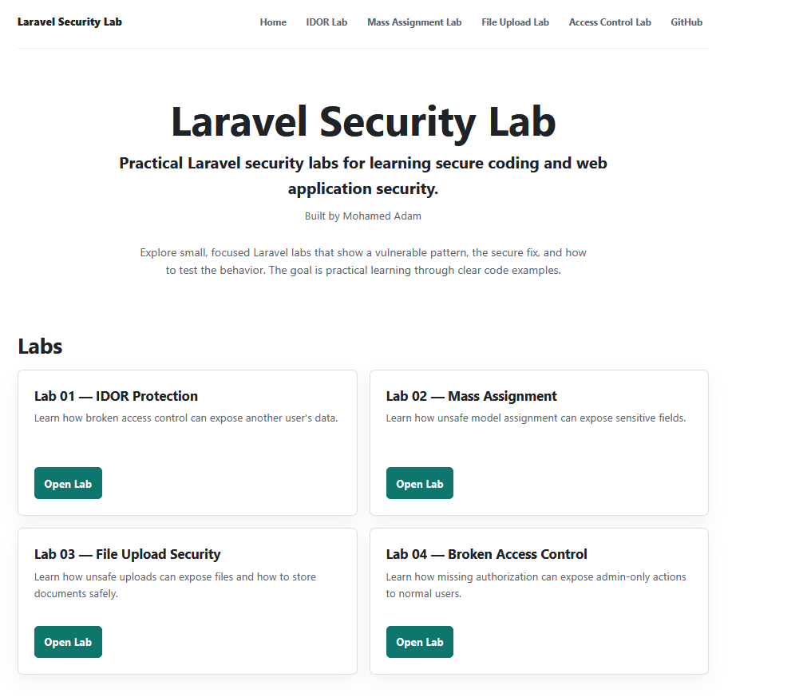
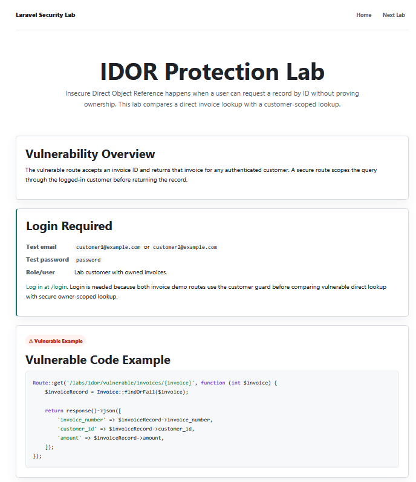
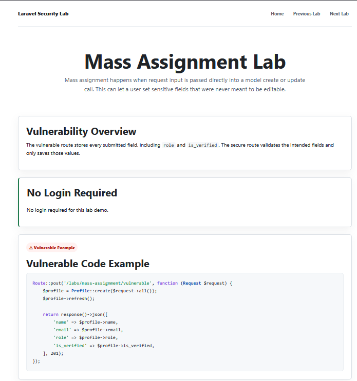
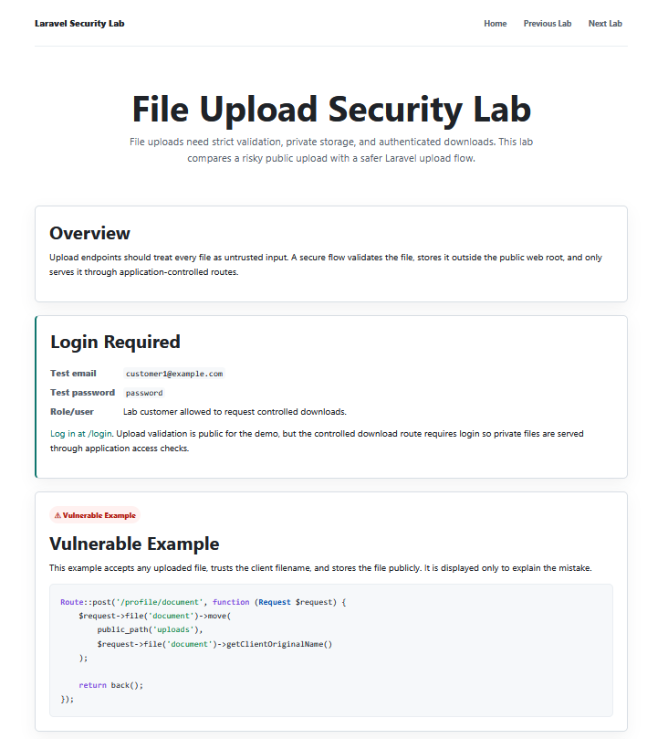
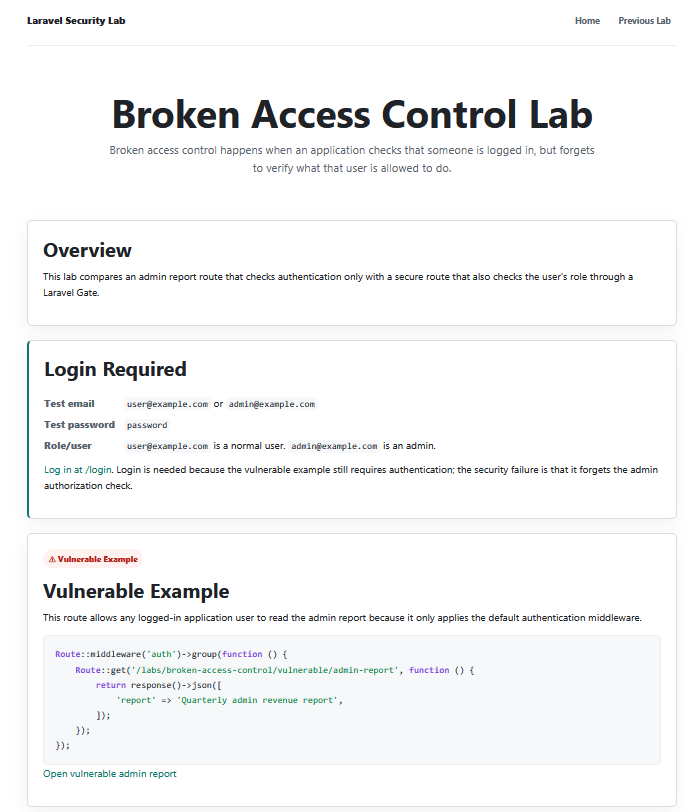

# Laravel Security Lab

A hands-on Laravel security learning project built by Mohamed Adam.

## What This Project Teaches

- Secure coding
- OWASP-inspired vulnerabilities
- Access control
- File upload security
- API/security testing basics
- Defensive Laravel development

## Current Labs

| Lab | Topic | Login Required? | What it demonstrates | Link |
| --- | --- | --- | --- | --- |
| 01 | IDOR Protection | Yes | Why direct record lookup can expose another customer's invoice, and how to scope access to the logged-in customer. | [`/labs/idor`](http://127.0.0.1:8000/labs/idor) |
| 02 | Mass Assignment | No | Why passing `$request->all()` into a model can save protected fields, and how to store validated fields only. | [`/labs/mass-assignment`](http://127.0.0.1:8000/labs/mass-assignment) |
| 03 | File Upload Security | Yes for downloads | PDF validation, private storage, generated filenames, and authenticated downloads. | [`/labs/file-upload-security`](http://127.0.0.1:8000/labs/file-upload-security) |
| 04 | Broken Access Control | Yes | Why login alone is not enough for admin-only actions, and how to protect a route with a Gate. | [`/labs/broken-access-control`](http://127.0.0.1:8000/labs/broken-access-control) |

## How to Run Locally

```bash
composer install
cp .env.example .env
php artisan key:generate
php artisan migrate:fresh --seed
php artisan serve
```

On Windows PowerShell, use `Copy-Item .env.example .env` instead of `cp .env.example .env`.

## Run Tests

```bash
php artisan test
```

## Test Accounts

Some labs require login. The seeders create these accounts:

| Account | Email | Password | Used for |
| --- | --- | --- | --- |
| Customer One | [customer1@example.com](mailto:customer1@example.com) | `password` | IDOR and file download demos |
| Customer Two | [customer2@example.com](mailto:customer2@example.com) | `password` | IDOR ownership comparison |
| Admin user | [admin@example.com](mailto:admin@example.com) | `password` | Secure admin report access |
| Normal user | [user@example.com](mailto:user@example.com) | `password` | Broken access control comparison |

Use `/login` to sign in with any seeded lab account.

## Screenshots

Screenshots are stored in `docs/screenshots/`.







## Lab Notes

- [Lab 01: IDOR Protection](labs/01-idor.md)
- [Lab 02: Mass Assignment](labs/02-mass-assignment.md)
- [Lab 03: File Upload Security](labs/03-file-upload-security.md)
- [Lab 04: Broken Access Control](labs/04-broken-access-control.md)

## Security Disclaimer

This repository is for defensive learning in local lab environments. Do not use these examples against systems you do not own or have explicit permission to test.
